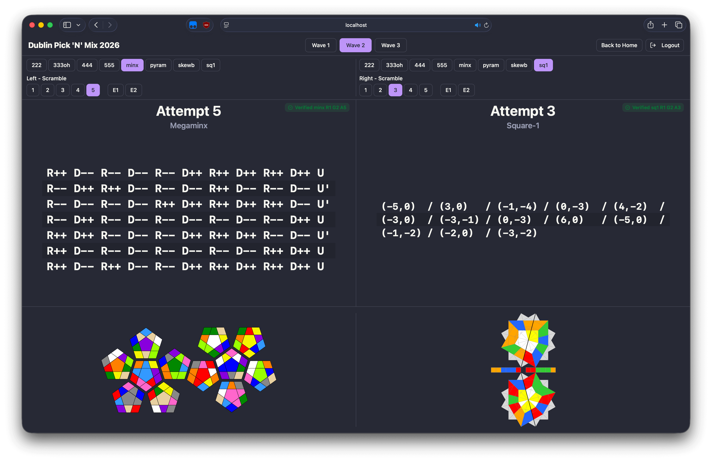
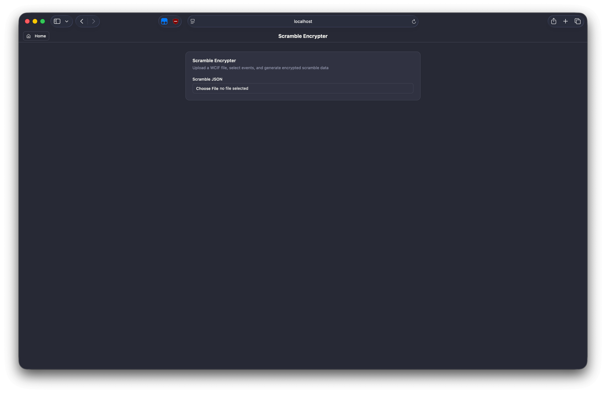
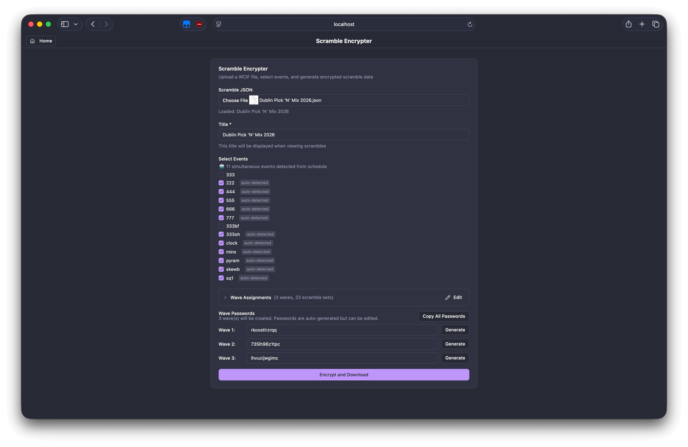
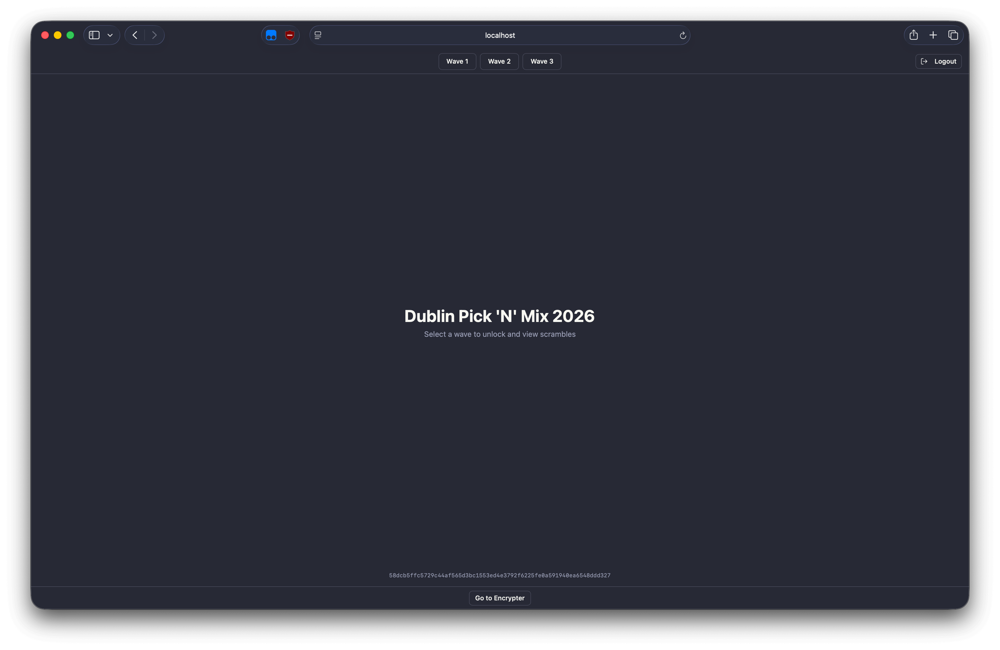
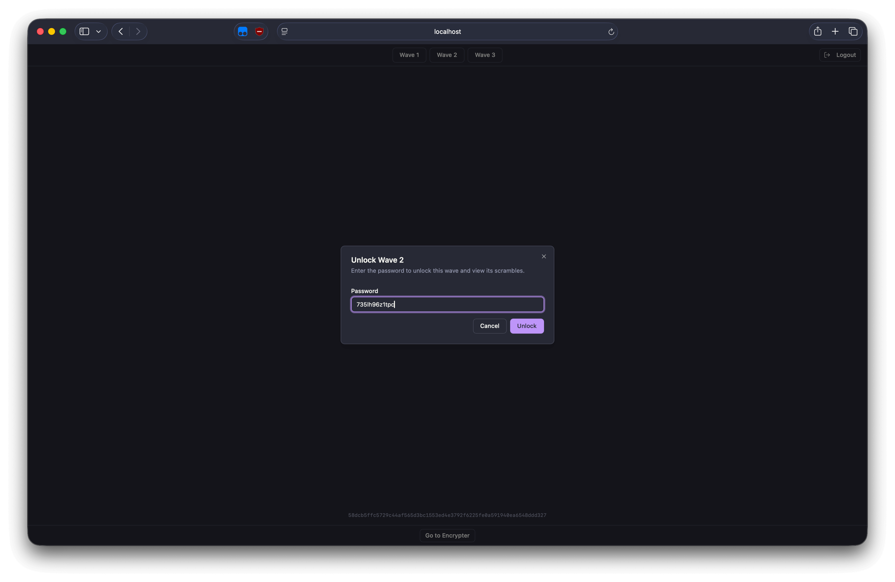

# Simultaneous Scrambling

Scramble viewer for running multiple events at the same time at World Cube Association competitions.

This tool encrypts the scrambles into waves which are password protected. Each wave is unlocked with a 12 character password seperately.



## Instructions

### Generating Encrypted Scrambles

1. Upload scramble JSON
2. Select events to include, and group them into waves (should be automatic)
3. Download JSON file with the encrypted scramble sets
4. Copy the unique passwords for the waves




### Viewer Mode

1. Upload encrypted scramble data file
2. Select a wave to unlock
3. Enter password for that wave
4. Each side of the screen can select events and attempts to view scrambles





## Security

- **AES-GCM encryption** (256-bit)
- **PBKDF2 key derivation** (600,000 iterations)
- **Per-wave encryption** - each wave encrypted separately
- **Scramble validation** - SHA-256 hashes verify scramble integrity
- **File integrity** - SHA-256 hash for file verification
- All encryption/decryption happens client-side

## Development

### Setup

```bash
bun install
```

### Run Dev Server

```bash
bun dev
```

### Build

```bash
bun run build
```

